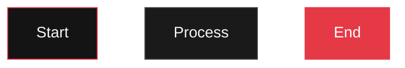

# ProtoForge Design System

## Anti-Trope Design Guidelines

This design system applies to ALL output from ProtoForge - software, hardware, hybrid, diagrams, 3D models, documentation, everything.

---

## ❌ NEVER Use These
- Purple gradients or indigo/purple colors
- Teal, green, or cyan as primary accents
- Rounded corners (border-radius: 0 always)
- "Friendly", soft, rounded aesthetics
- Hero sections with big gradients
- Card-based layouts everywhere
- Inter font
- "AI slop" / generic AI product look

---

## ✅ ALWAYS Use These

### Colors
- **Background**: #0a0a0a (deep black)
- **Surface**: #141414 
- **Panel**: #1a1a1a
- **Text Primary**: #f5f5f0
- **Text Secondary**: #a0a0a0
- **Accent**: #e63946 (red)
- **Highlight**: #ffbe0b (yellow)
- **Orange**: #ff3e00
- **Borders**: #2a2a2a, #444

### Typography
- **Headers/Code**: IBM Plex Mono, Courier New, Fira Code, monospace
- **Body**: IBM Plex Sans, Helvetica Neue, system-ui

### Aesthetics
- Sharp edges (border-radius: 0)
- Dark theme default
- High contrast
- Brutalist/industrial look
- Borders over shadows
- Technical, developer-focused

---

## For SOFTWARE/Web

### CSS Rules
```css
/* ALWAYS */
* { border-radius: 0 !important; }

/* Dark theme */
body { background: #0a0a0a; color: #f5f5f0; }

/* Buttons */
.btn {
  background: #e63946;
  color: white;
  border: none;
  padding: 12px 24px;
  font-family: 'IBM Plex Mono', monospace;
  text-transform: uppercase;
  letter-spacing: 1px;
  border-radius: 0;
}

/* Cards */
.card {
  background: #141414;
  border: 1px solid #2a2a2a;
  padding: 20px;
  border-radius: 0;
}

/* Inputs */
.input {
  background: #0a0a0a;
  border: 1px solid #444;
  color: #f5f5f0;
  padding: 12px;
  font-family: 'IBM Plex Mono', monospace;
  border-radius: 0;
}
.input:focus {
  border-color: #e63946;
  outline: none;
}
```

### Example: Landing Page
- Header with logo and nav (no hero image)
- Features as grid of bordered cards
- Sharp corners everywhere
- Monospace typography
- Red/yellow accents for CTAs

---

## For HARDWARE/3D Models

### 3D Printing
- **Material**: PLA or PETG (not ABS)
- **Colors**: #2d3436, #1a1a1a, #e63946
- **Wall thickness**: 2mm minimum
- **Layer height**: 0.2mm
- **Infill**: 20%

### Enclosure Design
- Sharp, industrial edges
- Ventilation slots (no curves)
- Wall-mount options
- Access panels with screws

### Circuit Diagrams
- Use Mermaid.js
- Dark background colors
- Red/yellow accent colors in diagram
- No rounded nodes

---

## For DIAGRAMS

### Mermaid Diagrams


### Colors for Diagrams
- Background: #0a0a0a or #141414
- Borders: #e63946 (accent), #444 (standard)
- Text: #f5f5f0
- Nodes: #1a1a1a with #2a2a2a borders

---

## For DOCUMENTATION

### README Files
- Use monospace fonts in code blocks
- Dark code highlighting
- Tables with sharp borders
- No decorative elements

---

## Summary

| Element | Rule |
|---------|------|
| Corners | Sharp (0 radius) |
| Colors | Dark + Red/Yellow |
| Fonts | Monospace headers |
| Borders | Yes |
| Shadows | No |
| Gradients | No |
| Friendly | No |
| Industrial | Yes |

---

Build things that developers and makers would be proud to use. Make it look like it was built by engineers, for engineers.
