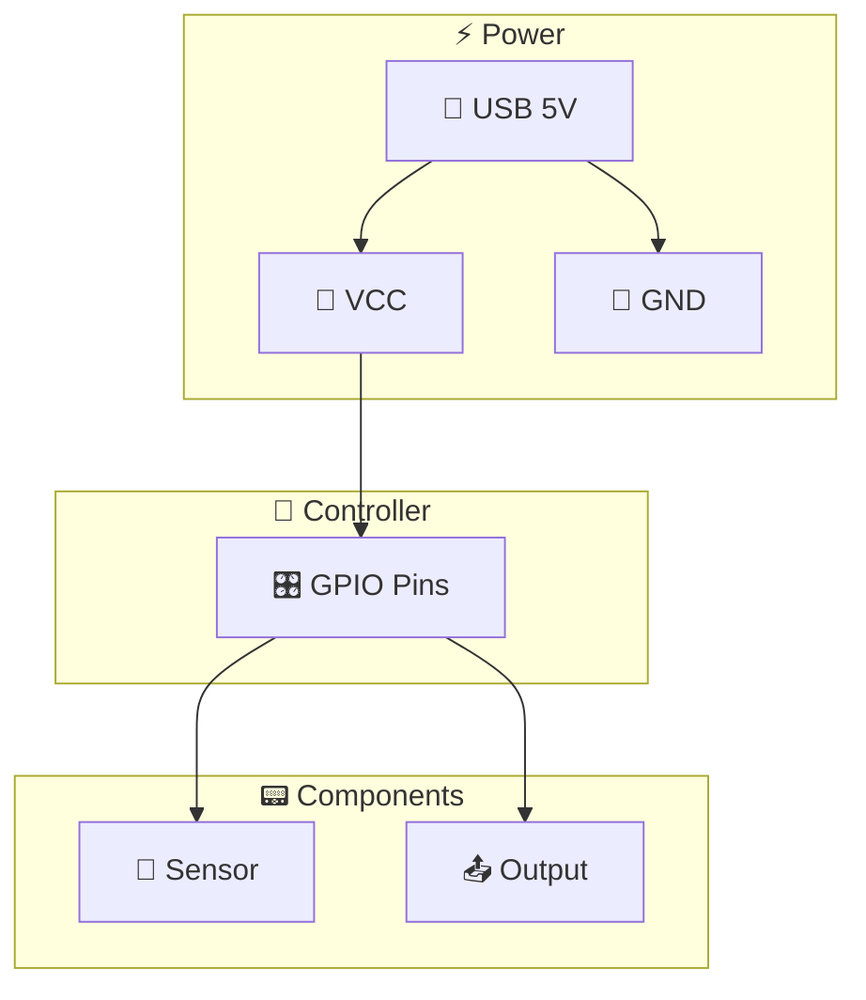
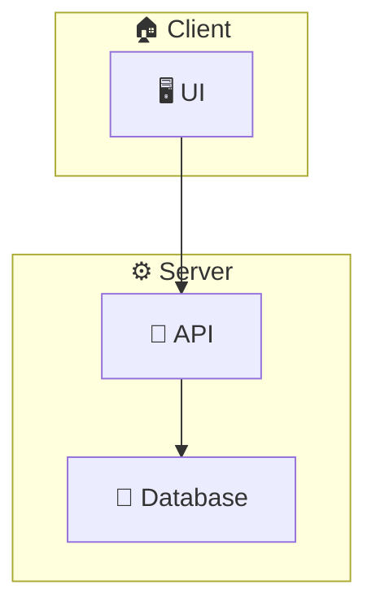

# Diagram Generation Skill

This skill generates Mermaid.js diagrams for hardware circuits and software components.

## Usage

When the user asks for:
- Circuit diagrams
- Wiring diagrams
- Component diagrams
- Architecture diagrams
- Flowcharts

Use the `write_file` tool to create `.md` files with Mermaid.js code blocks.

## Circuit Diagram Template

## Component Diagram Template

## Output Files

Save diagrams to:
- `/mnt/user-data/outputs/circuit.md` - Circuit diagrams
- `/mnt/user-data/outputs/components.md` - Component diagrams
- `/mnt/user-data/outputs/architecture.md` - Architecture diagrams
